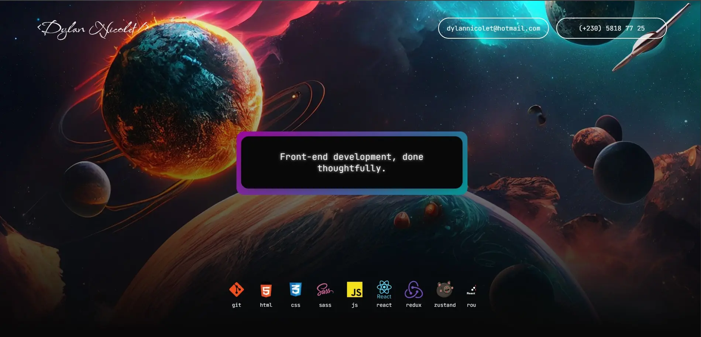

# My Portfolio Website

This is the repository for my personal website, version 2: https://dylannicolet.netlify.app/

There, I share a bit about my journey and the technologies I've used and trained on.

Feel free to visit, and don’t hesitate to get in touch if you see anything that could be improved.

## Tech Used

- Framework: [React](https://reactjs.org/) using [Vite](https://vite.dev/) instead of CRA
- Styling: SCSS
- Deployment: Netlify

### Link to V1's repository: https://github.com/DylanNicolet/dylannicolet-website